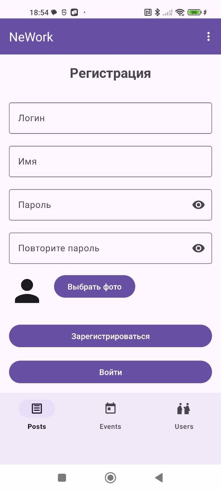
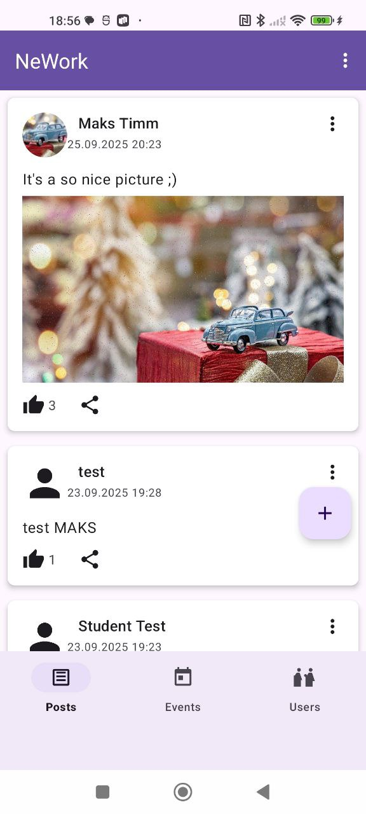
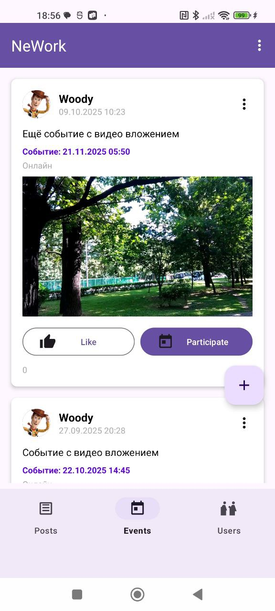
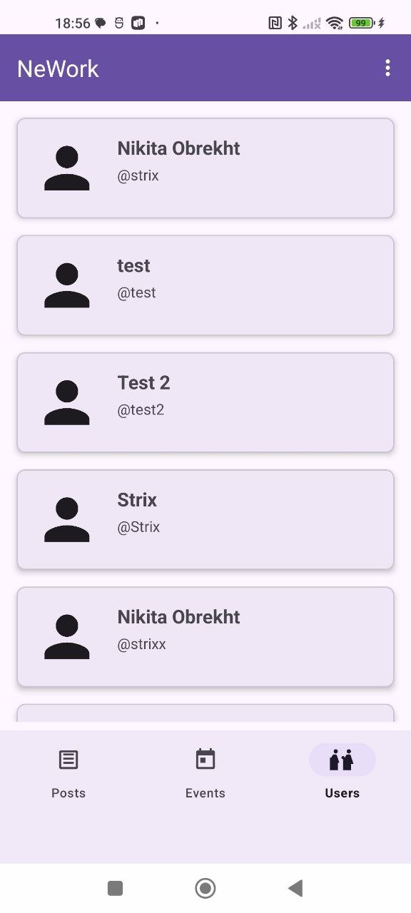

# NeWork - Android приложение для социальной сети

## Описание проекта

NeWork — современное социальное приложение для Android, предоставляющее пользователям удобные инструменты общения, публикации постов и событий, а также возможность участвовать в жизни сообщества с любого устройства. Все действия в приложении (регистрация, авторизация, создание постов, взаимодействие с событиями) реализованы согласно требованиям серверного API и спецификации Swagger. Приложение полностью адаптировано под актуальные требования мобильной разработки: деликатная работа с правами, проверка формата запросов и токенов, обработка ошибок и стабильная работа с сетью.

## Основной функционал

- Регистрация и авторизация пользователей (JWT + Api-Key)
- Публикация текстовых постов с фото, ссылками, гео-метками
- Лайки, комментарии, упоминания пользователей
- Создание и участие в событиях
- Просмотр и редактирование профиля
- Отображение карты событий
- Загрузка и просмотр изображений

## Скриншоты







## Функциональность

### Основные возможности:
- **Регистрация и авторизация** - создание аккаунта и вход в систему
- **Лента постов** - просмотр и создание постов с текстом, изображениями и ссылками
- **События** - создание и участие в событиях (онлайн/офлайн)
- **Профили пользователей** - просмотр и редактирование профилей
- **Интерактивность** - лайки, комментарии, участие в событиях
- **Карты** - отображение местоположения событий
- **Медиа** - загрузка и просмотр изображений

### Технические особенности:
- **Архитектура MVVM** с использованием ViewModel и LiveData
- **Dependency Injection** с помощью Hilt
- **Сетевое взаимодействие** через Retrofit и OkHttp
- **Локальное хранение** с Room Database
- **Навигация** через Navigation Component
- **Асинхронность** с Kotlin Coroutines

## Технологический стек

### Основные технологии:
- **Kotlin** - основной язык разработки
- **Android SDK** - платформа разработки
- **Material Design** - дизайн-система

### Архитектура и паттерны:
- **MVVM** (Model-View-ViewModel)
- **Repository Pattern**
- **Dependency Injection** (Hilt)

### Библиотеки:
- **Retrofit** - HTTP клиент для API
- **OkHttp** - HTTP библиотека
- **Room** - локальная база данных
- **Hilt** - dependency injection
- **Navigation Component** - навигация
- **Glide** - загрузка изображений
- **Coroutines** - асинхронное программирование
- **LiveData/StateFlow** - реактивное программирование

## Структура проекта

```
app/
├── src/main/java/ru/netology/nework/
│   ├── api/
│   │   ├── NetworkModule.kt
│   │   └── SimpleHttpClient.kt
│   ├── model/
│   │   ├── Post.kt
│   │   ├── Event.kt
│   │   └── User.kt
│   ├── repository/
│   │   ├── PostRepository.kt
│   │   ├── EventRepository.kt
│   │   └── UserRepository.kt
│   ├── ui/
│   │   ├── posts/
│   │   ├── events/
│   │   ├── profile/
│   │   └── users/
│   └── util/
├── src/main/res/
│   ├── layout/
│   ├── values/
│   └── drawable/
└── build.gradle.kts
```

## Установка и запуск

### Требования:
- **Android Studio** Arctic Fox или новее
- **JDK 11** или новее
- **Android SDK** API 24+
- **Эмулятор** или физическое устройство

### Шаги установки:

1. **Клонирование репозитория:**
```bash
git clone <repository-url>
cd NeWork2
```

2. **Открытие в Android Studio:**
- Запустите Android Studio
- Выберите "Open an existing project"
- Укажите папку с проектом

3. **Синхронизация проекта:**
- Android Studio автоматически синхронизирует Gradle
- Дождитесь завершения загрузки зависимостей

4. **Настройка эмулятора:**
- Создайте AVD (Android Virtual Device)
- Рекомендуется API 24+ с Google Play Services

5. **Запуск приложения:**
- Нажмите кнопку "Run" (зеленая стрелка)
- Выберите устройство для запуска

## Конфигурация

### API настройки:
Приложение использует внешний API сервер. Убедитесь, что:
- Сервер доступен по адресу `http://94.228.125.136:8080`
- API ключ настроен в `NetworkModule.kt`
- Интернет-соединение активно

### Google Maps:
Для работы карт необходимо:
1. Получить API ключ Google Maps
2. Добавить ключ в `app/src/main/res/values/google_maps_api.xml`
3. Настроить ограничения ключа для вашего приложения

## Архитектура приложения

### MVVM Pattern:
- **Model** - данные и бизнес-логика
- **View** - UI компоненты (Activity, Fragment)
- **ViewModel** - связующее звено между View и Model

### Repository Pattern:
- Централизованное управление данными
- Абстракция источников данных (сеть, локальная БД)
- Единая точка доступа к данным

### Dependency Injection:
- Hilt для автоматического внедрения зависимостей
- Упрощение тестирования
- Слабая связанность компонентов

## Основные экраны

### 1. Авторизация
- Вход в систему
- Регистрация новых пользователей
- Валидация данных

### 2. Лента постов
- Отображение постов пользователей
- Создание новых постов
- Лайки и комментарии

### 3. События
- Просмотр событий
- Создание событий
- Участие в событиях

### 4. Профиль
- Личная информация
- История активности
- Настройки

### Endpoints:
- `POST /api/users/registration` - регистрация
- `POST /api/users/authentication` - авторизация
- `GET /api/posts` - получение постов
- `POST /api/posts` - создание поста
- `GET /api/events` - получение событий
- `POST /api/events` - создание события

### Аутентификация:
- API ключ в заголовке `Api-Key`
- JWT токен для авторизованных запросов
- Автоматическое обновление токенов

## Разработка

### Стиль кода:
- Следование Kotlin Coding Conventions
- Использование camelCase для переменных
- Комментарии на русском языке
- Логирование для отладки

### Тестирование:
- Unit тесты для ViewModels
- Integration тесты для Repository
- UI тесты для критических сценариев

### Отладка:
- Подробное логирование в Logcat
- Проверка сетевых запросов
- Валидация данных

## Лицензия

Проект разработан в рамках образовательной программы Нетологии.

## Контакты

- **Курс:** Мобильная разработка
- **Платформа:** Нетология
- **Год:** 2025
